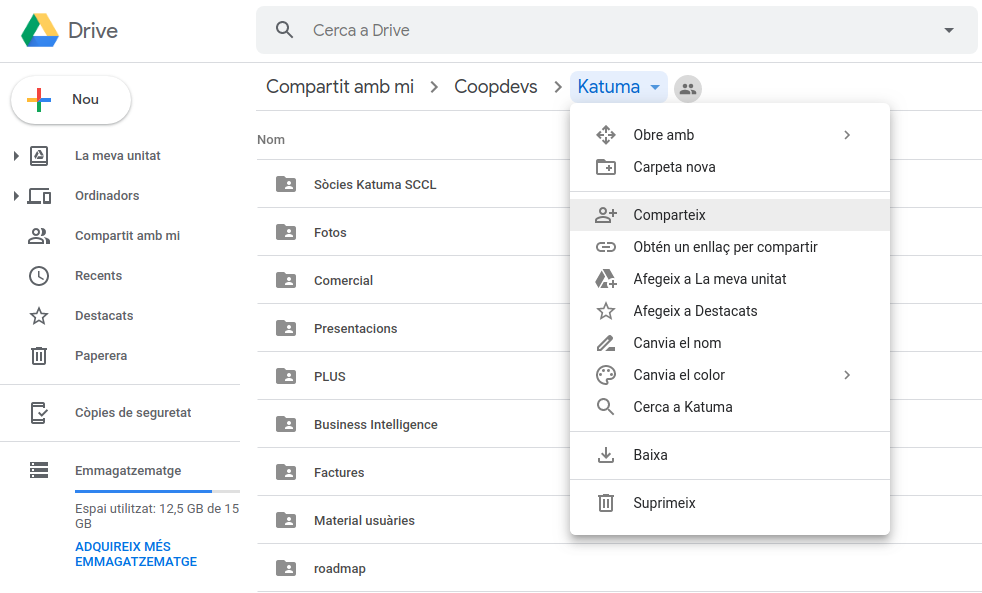

## Índex

- [Trello](#trello)
- [Toggl](#toggl)
- [Calendari](#calendari)
- [Bitwarden](#bitwarden)
- [Google Drive](#google-drive)
- [LimeSurvey](#limesurvey)

## Trello

Des del board de Katuma, clica a "Invite" i introdueix el mail de la persona. Això la permetrà crear-se el compte i entrar al board per ella mateixa. Des del moment en que està convidada ja se la pot mencionar i assignar a cards.

## Toggl

Per afegir a un usuari nou a Toggl cal primer de tot seleccionar el workspace de Coopdevs, com és habitual.

Després, des de "Team" se l'ha d'afegir a la llista especificant el seu mail, sense assignar-la a cap grup en especial. Fins que la persona no accepti la invitació no podem passar al pas següent perquè no apareixerà a la llista de membres.

Un cop fet navegueu al projecte Katuma des de "Projects", cliqueu-hi per entrar als detalls del projecte i moveu-vos a la pestanya "Team". Ara sí, us apareixerà l'usuari al camp "Add members to team...". Seleccioneu i cliqueu a "Add to team".

## Calendari

A dia d'avui encara compartim el Calendari amb Coopdevs. Segueix els [passos](https://github.com/coopdevs/handbook/wiki/Proc%C3%A9s-d%27onboarding#calendari) del procés d'onboarding de Coopdevs.

## Bitwarden

El gestor de contrasenyes també és compartit amb Coopdevs però els permisos són una mica diferents per als membres de Katuma.

Primer de tot, navega a l'administració de l'organització Coopdevs clicant al nom al menú lateral anomenat _Organitzacions_ de la pàgina inicial del teu compte de Bitwarden. Seguidament desplaçat a la pestanya _Administra_. Des d'aquí pots convidar a la persona clicant a _Convida usuari_.

Al modal que t'apereixerà, introdueix el correu electrònic de la persona, selecciona el tipus d'usuari _Usuari_ i marca _Aquest usuari només pot accedir a les col·leccions seleccionades._ com a control d'accés. De la llista de col·leccions selecciona només _Katuma_.

Per acabar, clica a _Guardar_.

## Google Drive

Hem de donar accés a la carpeta "Katuma", que és on guardem tota la documentació del projecte.

Des del mateix nom de carpeta, clica a l'ítem _comparteix_ del menú i introdueix el seu mail al camp _Persones_ del diàleg que haurà aparegut. Assegura't que dones permisos per afegir i editar.

## LimeSurvey

Per donar accés a forms.coopdevs.org hem de crear un nou usuari. Ho podem fer des del menú desplegable _Configuració_, situat a la cantonada superior dreta. A continuació clica a _Gestió d'usuaris i/o administradors_. Des de la nova pàgina clica a _Afegeix un usuari_ i introdueix les dades. Això enviarà una invitació a la persona especificada.

Els permisos concrets es poden modificar posteriorment des de la llista d'usuaris clicant a la icona del candau descrit amb _Establir permisos globals per a aquest usuari_. Sí, aquest missatge és una mica confús. Des de la pàgina següent especifiqueu els permisos que es mostren a continuació.

Ara només cal que cliqueu a _Desa_.
