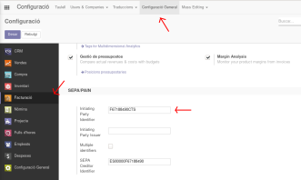
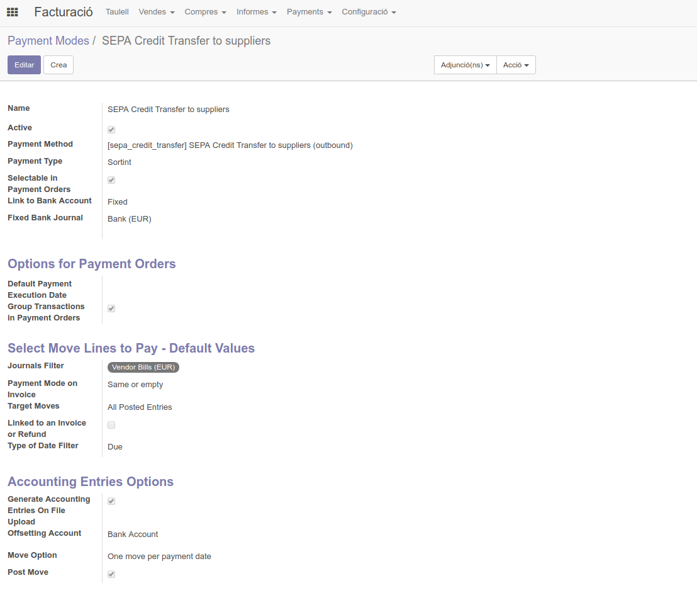
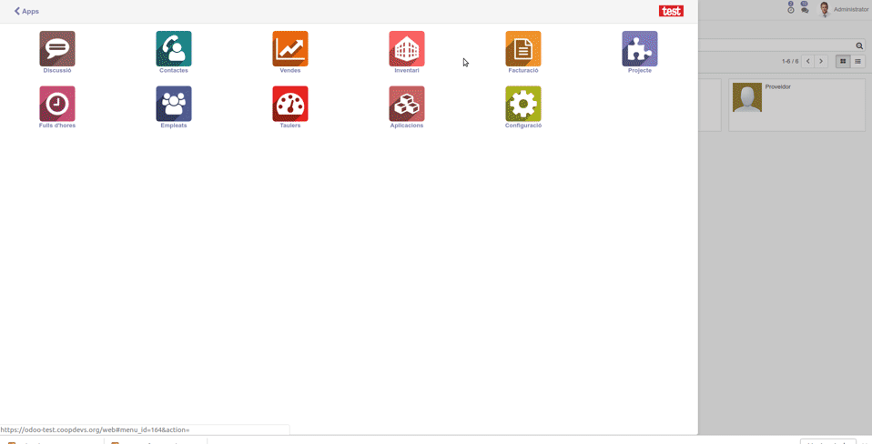
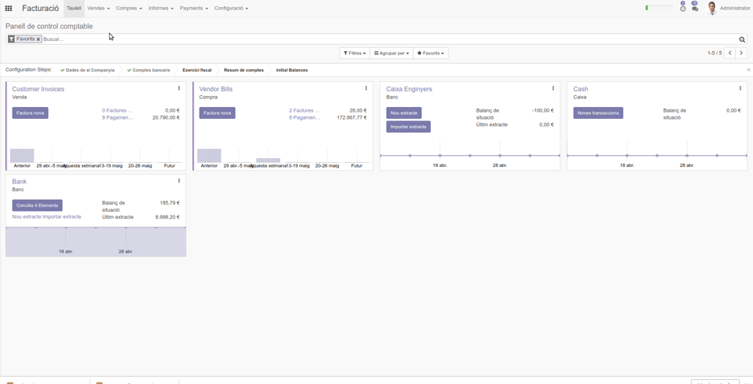

# SEPA Direct Debit in Odoo 11 - Català

## Que és SEPA?

https://es.wikipedia.org/wiki/Zona_%C3%9Anica_de_Pagos_en_Euros

## Mòduls SEPA para Odoo

Al voltant d'Odoo trobem diferents mòduls per gestionar tant mandats com debit/payment ordres.

Nosaltres farem servir els següents mòduls de l'OCA:
- [Account Banking SEPA Direct Debit](https://github.com/OCA/bank-payment)

## Configuracions
1. Configuració de la companyia

Per poder generar el fitxer SEPA que pujarem a la nostra entitat bancaria per realitzar les remeses, cal una configuració prèvia.

### Initiating Party Identifier
Anant a `Facturació > Configuració > Configuració` accedim a la configuració de la part de comptabilitat/facturació.
En aquest punt, trobem el camp *Initiating Party Identifier*, el qual hem d'omplir amb el valor que ens proporcioni la nostra entitat bancaria com identificador. Aquest valor es indispensable per generar el fitxer SEPA correctament amb el tag `OrgId` al seu lloc.

 

### SEPA Creditor Identificador
Anant a `Facturació > Configuració > Configuració` accedim a la configuració de la part de comptabilitat/facturació.
En aquest punt, trobem el camp *SEPA Creditor Identifier*, el qual hem d'omplir amb el valor que ens proporcioni la nostra entitat bancaria com identificador.

> Podem calcular l'Identificador SEPA amb: https://academy.holded.com/tesoreria/remesas/como-calcular-el-id-de-acreedor-sepa

### Compte bancari

Cal tenir un compte bancari associat amb la nostra companyia, per fer això podem fer:

Anem a `Facturació > Configuració > Comptes Bancaris`, aquí hem de crear el compte bancari de la nostra companyia i associar-lo a aquesta amb el camp `Empresa`. Són necessaris tant l'IBAN com el banc on tenim el compte.

> Per generar el compte bancari de la companyia cal tenir permisos d'Administrador o bé tenir actiu els permisos de *Bank Account* al panell de permisos de l'Usuari, apartat *Other extra rights*.

2. Configuració Modo de Pago

Per finalitzar la configuració cal crear un mètode de pagament associat al compte bancari de la companyia que acabem de crear. Per fer això podem accedir a `Facturació > Configuració > Modes de pagament`.

En aquesta pantalla hem de crear un mode de pagament indicant els següents valors:

- Payment Method: *SEPA Direct Debit for customers* o *SEPA Credit Transfer to suppliers*
- Link to Bank Account: *Fixed* si només fem servir un compte o *Variant* si tenim definits els comptes bancaris per als diferents comptes del pla comptable.

## Ús dels fitxers SEPA
## Creació de Mandats SEPA

Per cada client o proveïdor al que volem girar un rebut SEPA, cal tenir un mandat signat. Aquest mandat es el contracte amb el qual aquella persona o entitat autoritza a realitzar cobraments directament al seu compte bancari.

Per generar els mandats SEPA a Odoo anem a la fitxa del client, a l'apartat `Vendes i Compres > Pagamanets` i fem clic a *Mandate(s)*.

Hem d'aportar un compte bancari (que ja ens ve filtrat pel titular), una data de signament del mandat i de quin tipus és.

Un cop creat el mandat, podem adjuntar un escaneig del mandat real per tenir-ho tot a l'abast

## Creació de Payment Orders

### Pagament de factures de proveïdors amb SEPA

Abans de començar ens hem de assegurar que els proveïdors que desitgem pagar per aquest mètode tinguin un compte Bancari definit i el Mode de Pagament "SEPA Credit Transfer to suppliers". Podem editar aquests camps a `Facturació > Compres > Proveïdors` així totes les factures que rebem d'aquests proveïdors automàticament les podrem afegir a Payment Orders tipus "SEPA Credit Transfer to suppliers"

1. Creem un Payment Order

Accedint a `Facturació > Payments > Payment orders` podem generar un nou Payment Order on afegir les factures a pagar. Indicarem **Mode de pagament : SEPA Credit Transfer to suppliers**, **Bank Journal** el compte Bancari des d'on volem fer els pagaments i desarem el Payment Order

2. Afegir factures al Payment Order

Un cop tenim el Payment Order, podem accedir a `Facturació > Compres > Factures de Proveidors`, seleccionar les factures que volem afegir a la remesa i fer clic a `Acció > Add to Payment/Debit Order`.

3. Extreure el fitxer SEPA

Per finalitzar el procés necessitem extreure el fitxer SEPA que importarem a l'aplicatiu de la nostra entitat bancaria, dins del Payment Order en qüestió podrem fer clic al botó `Confirm Payments` i descarregar el fitxer. 

(WIP: provar que fa el botó `File Successfully Uploaded` un cop estigui el fitxer enviat al banc) 

### Pagament de nòmines de treballadors amb SEPA

1. Els empleats poden tenir mètode de cobrament (SEPA) i compte bancari, al igual que una empresa proveïdora.  Si anem a `Empleats` seleccionem l'empleat i anem a la pestanya `Private information > Private Address` aquí podrem associar l'empleat amb un "Contacte" dins del qual haurà de tenir un Compte Bancari dins la pestanya `Vendes i Compres` i Supplier Payment Mode: SEPA a dins la pestanya `Facturació`

2. En els assentaments comptables d'una nòmina tindrem sempre la quantitat a pagar contra el compte **465000 Remuneraciones pendientes de pago** i en el mateix assentament la empresa relacionada, en aquest cas serà el treballador. En [aquest vídeo](https://www.youtube.com/watch?v=Ih-xASGIEh0) trobaràs la explicació de com tenir comptabilitzada correctament un nòmina.

3. Creem un nou "Payment order" `Facturació > Payments > Payment orders` 
  * Metode de pagament "SEPA"
  * Clic al botó `Create Payment Lines from Journal Items`
  * "Due Date" avui
  * Afegim els assentaments comptables fent  "Afegeix un element" > "Filtrar" > "Afegir un filtre personalitzat "per "compte" conté "465" trobarem els assentaments per afegir

### Retorn dels diners de despeses a treballadors amb SEPA

1. Els empleats poden tenir mètode de cobrament (SEPA) i compte bancari, al igual que una empresa proveïdora.  Si anem a `Empleats` seleccionem l'empleat i anem a la pestanya `Private information > Private Address` aquí podrem associar l'empleat amb un "Contacte" dins del qual haurà de tenir un Compte Bancari dins la pestanya `Vendes i Compres` i Supplier Payment Mode: SEPA a dins la pestanya `Facturació`

2. Les Despeses que volem retornar han de complir:
  * Payment By: Employee (to reimburse)
  * Empleat: Un empleat que compleixi amb el punt 1

Un cop la despesa hagi estat aprovada i es faci clic al botó "Assentar assentaments" es podrá crear el fitxer Sepa

3. Creem un nou "Payment order" `Facturació > Payments > Payment orders`
  * Metode de pagament "SEPA"
  * "Due Date" avui
  * fem clic al botó "Create Payment Lines from Journal Items"
  * Afegim assentaments "Afegeix un element" > "Agrupar per" "Afegeix un grup personalitzat" "Despeses"

## Trucs

* Com fer que els números de compte surten a les factures:

En generar les factures, cal que indiquem el mode de pagament que hem creat anteriorment associat al nostre número de compte.
