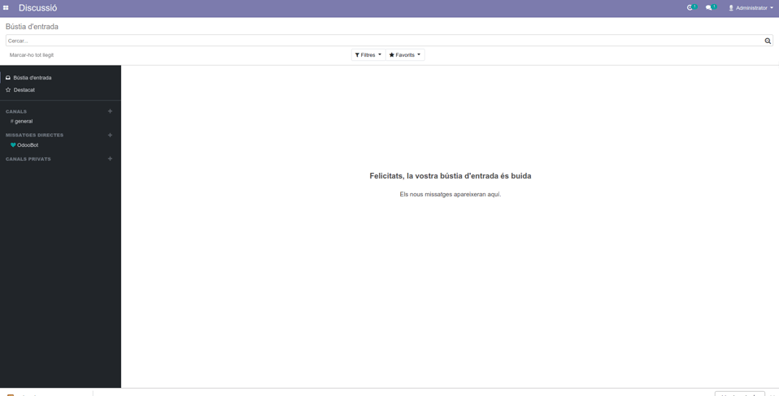

Un cop creada la nova instància o base de dades de Odoo hem de realitzar les següents accions per tal de configurar la nova empresa. En les instàncies amb més d'una base de dades, necessitem haver fet [el procés de sistemes corresponent](https://github.com/coopdevs/handbook/wiki/Add-new-DB-to-a-multi-db-odoo-instance). En el cas d'instància dedicada, necessitem haver completat [aquest altre procés](https://gitlab.com/coopdevs/odoo-provisioning/-/wikis/How%20to%20create%20a%20new%20Odoo%20instance).

## Canviar password usuari admin
Per defecte es crea un usuari admin/admin, entrem a l'usuari 
Si volem tenir accès guardar a Bitwarden (collection: Odoo)

Canviar també la llengua de l'usuari admin al català, si es vol, tota la documentació que fem és per l' odoo en català

## Afegir llengües
`Menú Principal > Configuració > Traduccions`

Per defecte ve instal·lat l'anglès. Afegim habitualment castellà (es_ES) i català (ca_ES)
Cal fer clic al "botó d'actualitzar termes" 🔄

##  Editar empresa, nom, logo, altres dades...

`Menú Principal > Configuració > Users & Companies > Empreses`

Fixar-se en el mail de l'Empresa que és per on per defecte s'enviaran els mails d'Odoo. Per exemple: odoo@processos.org

##  Configurar SMTP: Configuració/Servidors de correu sortint

`Menú Principal > Configuració > Configuració general` fem clic a `Outgoing Email Servers` Creem un nou

* Mandrillapp
* Host smtp.mandrillapp.com
* Seguretat TLS
* Port 587
* SMTP Username Coopdevs
* SMTP Password any valid API key (Entrar a mandrillapp.com)

Per una explicació més extesa, vegeu [[Configurar-el-compte-SMTP-per-Odoo-amb-Mandrill-i-Cdmon]]

Ens hem trobat algun cas en el qual el correu no sortia sense configurar als paràmetres generals mail.catchall.domain = "eldomini.xxx" i mail.catch.alias = "compte" (pe. foddcoopbcn.cat)

## Activar link de restablir contrasenya al login

`Menú Principal > Configuració > Configuració general`

Marcar check "Restablir contrasenya"

## Plantilla del document

`Menú Principal > Configuració > Configuració general`

Escollir la plantilla desitjada.

##  Crear un usuari principal al Client

A `Menú Principal > Configuració > Users & Companies > Usuaris`

Amb accés top a tots els mòduls i `Administració` amb **poder assignar permisos**

Enviar invitació a l'usuari per mail

##  Assignar idioma i altres valors per defecte pels nous usuaris

A `Configuració general > Tècnic > Accions > Valors per defecte de l'usuari`

Cal afegir o editar el camp Idioma (res.partner) i assignar el codi ISO de l'idioma predeterminat "ca_ES", "es_ES" o el que correspongui. De la mateixa manera es poden assignar els valors per defecte d'altres camps en el moment de crear nous usuaris.  
Definir País (res.partner) com a 68, corresponent a Espanya. 

## Fiscal Localization

`Menú Principal > Configuració > Configuració general > Facturació`

Escollir el paquet que la empresa necessita. Generalment "PGCE PYMEs 2008", pero s'ha de confirmar amb el client.
Nomes surt si no hi ha assentaments contables fixats.

## Impostos per defecte

`Menú Principal > Configuració > Configuració general > Facturació`

Si l'empresa fa servir com a productes majoritariament serveis, podem escollir els impostos que es faran servir per defecte durant la creació de nou productes. S'ha de confirmar amb el client.

## Importar listado de bancos españoles
Incorporar la lista de bancos españoles