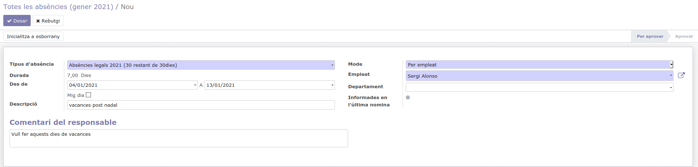

Els empleats de Coopdevs han de solicitar vacances o informar dels dies que han estat de baixa al departament de recursos humans mitjançant Odoo. 

Al menú principal **Absències** > Seleccionar dia o grups de dies fent clic al calendari i seleccionar el tipus d'absència, les dates seran validades per recursos humans. 

:warning: **Confirmar que els dies que apareixen en la suma de dies camp "Durada" son dies laborables**. Odoo té els caps de setmana i els festius d'Espanya inclosos i no els suma en la "Durada" quan escollim un interval. Si el teu interval inclou un dia festiu local fes varies sol·licituds d'intervals on no s'inclogui aquest dia.

## Baixes

Si es una baixa puntual que preveiem que no durarà més de un dia, un refredat o algun accident lleu o similar, no cal que anem al metge a demanar la baixa, assumeix el cost Coopdevs

En cas de que la baixa sigui de més de 1 dia, caldrà fer arribar a RRHH la baixa mèdica perquè la tramiti. 