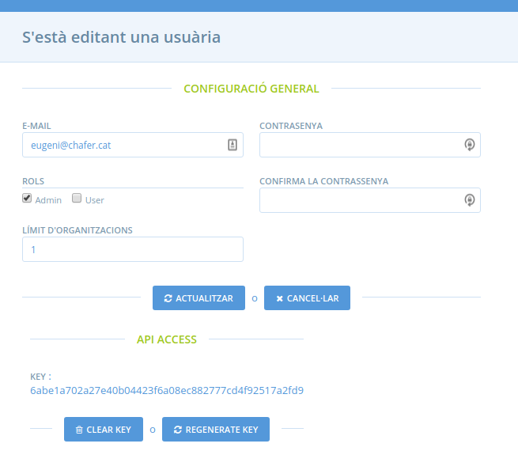

## Eliminar límit d'organitzacions

Tal s'especifica a la [pàgina de quotes](http://katuma.org/pricing.html) tots els trams inclouen "Opció de gestionar perfils addicionals il·limitats" de manera que eliminem la restricció sempre que un usuari ens ho demani.

A OFN tots els usuaris tenen restringida la creació d'organitzacions a 5 per defecte a través del camp `enterprise_limit` que és de tipus enter així que l'única manera de poder eliminar aquesta restricció és actualizar-lo amb una quantitat molt gran.

Per això, entrant com a superadmin a la secció d'administració, cerca l'usuari que crearà les organitzacions introduint el seu email. Un cop trobat clica al email al llistat de resultats per entra a la pàgina d'edició d'usuari.

Des d'aquí, introdueix el valor `2147483647` al camp _límit d'organitzacions_ i prem a _actualitzar_ amb això hauràs eliminat la limitació de forma efectiva.

Paral·lelament, el canvi també es pot fer des de línia de comandes fent ús de https://github.com/openfoodfoundation/openfoodnetwork/pull/4400, executant la comanda `bundle exec rake ofn:remove_enterprise_limit[<user_id>]` des del servidor de producció.
