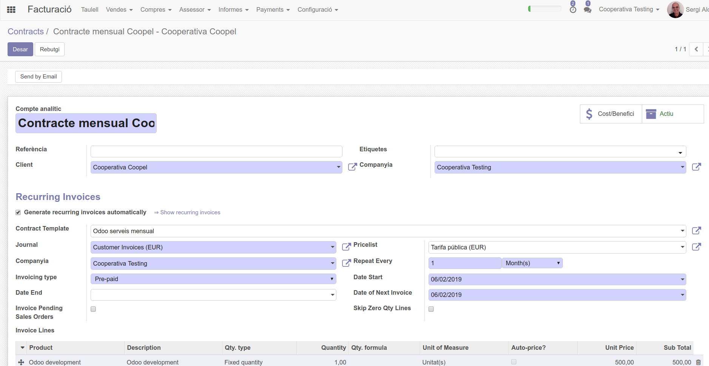
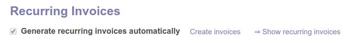
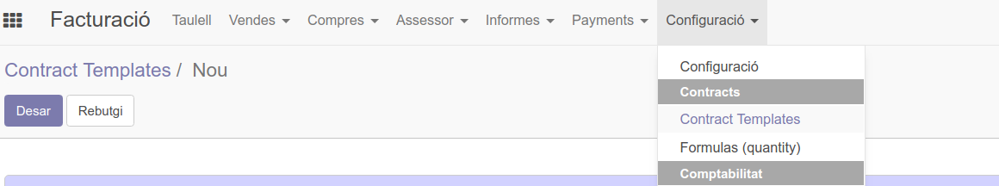
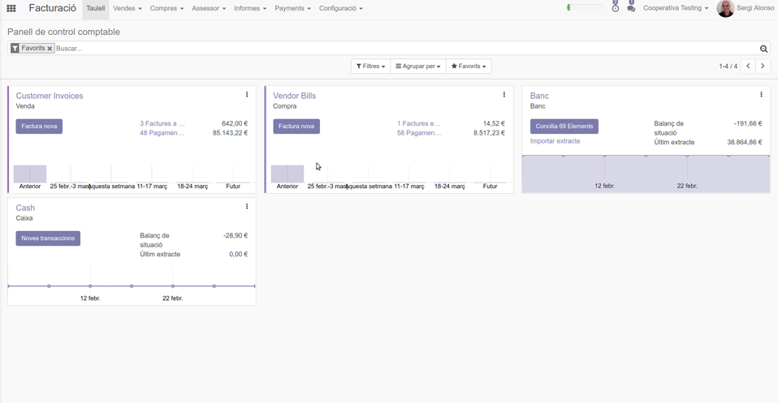
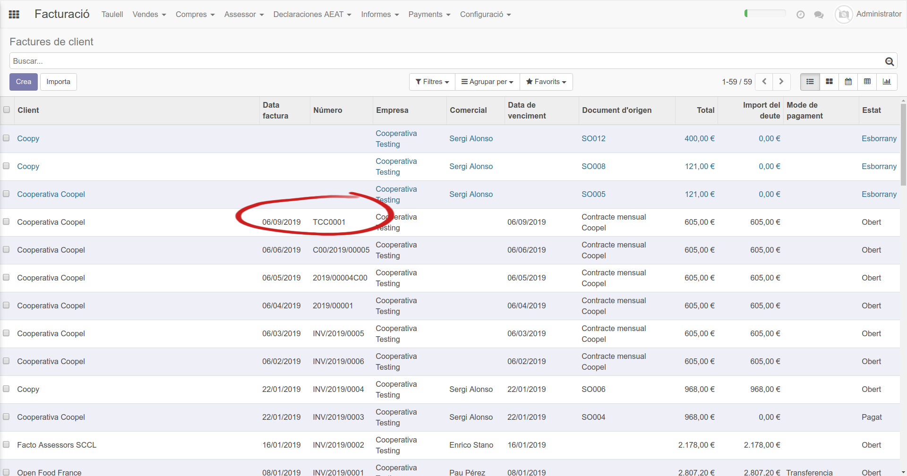

## Creació d'un nou contracte

Els passos per crear el contracte son:

1.  Obrim la pantalla de Contracts: `Facturació > Vendes > Contracts`
2.  Fem clic al botó Crear.
3.  Al nom indiquem el nom del contracte
4.  Seleccionem el client al qual volem facturar amb recurrència.
5.  Escollim si es pagarà abans del període o després (pre/post Paid)
6.  Escollim cada quant temps es farà la factura (diari/setmanal/mensual/...) i la data d'inici del contracte. 
7.  Podem escollir ["Contract Template"](#crear-un-contract-template) en cas que en tinguem. 
8.  Afegim, línies de factura.
9.  Desem

## Creació de factures partint d'un contracte

Les factures es crearan la data d'inici del contracte. 

Un administrador veu el botó "Create Invoices" que simularà el moment en què s'hauria de crear la següent factura. 

## Crear un Contract Template

Obrim la pantalla de Contract Templates: `Facturació > Configuració > Contract Templates` fem clic al botó Crear

4.  Omplim el formulari
  * Afegir les línies de factura que sabem que es cobraran periòdicament amb regularitat.
  * A la línea de factura podem marcar auto-price? per tal de que els preus s'actualitzin directament de un llistat de preus, o bé indicar el preu fixe a mà. 
  * Escollir "Pricelist" perquè agafi el preu del llistat de preus
  * Pre-paid/Post-paid si volem el pagament abans o després del període indicat

8.  Desar

## Seqüències de factura per cada tipologia de contracte 

És possible que necessitem diferents tipus de seqüències de factura per generar el nº/codi de factura per cada tipologia de contracte. Per exemple per un tipus concret de contracte (TCC) podríem voler que les factures fossin amb la seqüència TCC0001, TCC0002, ...

Per a fer-ho haurem de definir el diari (journal) del contracte amb la seqüència concreta que desitgem.

1. Anem a `Configuració > Diaris`
2. Entrem en el diari de vendes i el dupliquem
3. Anomenem el diari, el codi i el primer número de seqüència
4. A "Seqüència de la factura" creem una nova seqüència
5. Indiquem prefix o sufix, grandària del nombre (mida de seqüència, per obtenir 0001 la "mida de seqüència" seria 4)
6. Finalment anem a `Vendes > Contracts` escollim el contracte al qual volem aplicar el diari que hem creat

Un cop s'executi la creació de factura del contracte ja ens el crearà amb la nova seqüència. 

