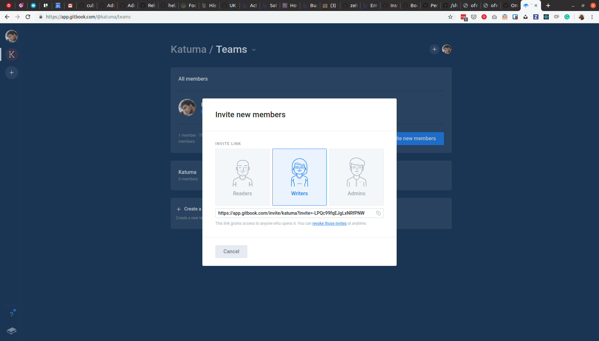

## Índex

- [Trello](#trello)
- [Toggl](#toggl)
- [Calendari](#calendari)
- [Bitwarden](#bitwarden)
- [Google Drive](#google-drive)
- [LimeSurvey](#limesurvey)
- [Gitbook](#gitbook)
- [Superadmin](#superadmin)

## Trello

Des del board de Katuma, clica a "Invite" i introdueix el mail de la persona. Això la permetrà crear-se el compte i entrar al board per ella mateixa. Des del moment en que està convidada ja se la pot mencionar i assignar a cards.

## Toggl

Per afegir a un usuari nou a Toggl cal primer de tot seleccionar el workspace de Coopdevs, com és habitual.

Després, des de "Team" se l'ha d'afegir a la llista especificant el seu mail, sense assignar-la a cap grup en especial. Fins que la persona no accepti la invitació no podem passar al pas següent perquè no apareixerà a la llista de membres.

Un cop fet navegueu al projecte Katuma des de "Projects", cliqueu-hi per entrar als detalls del projecte i moveu-vos a la pestanya "Team". Ara sí, us apareixerà l'usuari al camp "Add members to team...". Seleccioneu i cliqueu a "Add to team".

## Calendari

A dia d'avui encara compartim el Calendari amb Coopdevs. Segueix els [passos](https://github.com/coopdevs/handbook/wiki/Proc%C3%A9s-d%27onboarding#calendari) del procés d'onboarding de Coopdevs.

## Bitwarden

El gestor de contrasenyes també és compartit amb Coopdevs però els permisos són una mica diferents per als membres de Katuma.

Primer de tot, navega a l'administració de l'organització Coopdevs clicant al nom al menú lateral anomenat _Organitzacions_ de la pàgina inicial del teu compte de Bitwarden. Seguidament desplaçat a la pestanya _Administra_. Des d'aquí pots convidar a la persona clicant a _Convida usuari_.

Al modal que t'apereixerà, introdueix el correu electrònic de la persona, selecciona el tipus d'usuari _Usuari_ i marca _Aquest usuari només pot accedir a les col·leccions seleccionades._ com a control d'accés. De la llista de col·leccions selecciona només _Katuma_.

Per acabar, clica a _Guardar_.

## Google Drive

Hem de donar accés a la carpeta "Katuma", que és on guardem tota la documentació del projecte.

Des del mateix nom de carpeta, clica a l'ítem _comparteix_ del menú i introdueix el seu mail al camp _Persones_ del diàleg que haurà aparegut. Assegura't que dones permisos per afegir i editar.

## LimeSurvey

Per donar accés a forms.coopdevs.org hem de crear un nou usuari. Ho podem fer des del menú desplegable _Configuració_, situat a la cantonada superior dreta. A continuació clica a _Gestió d'usuaris i/o administradors_. Des de la nova pàgina clica a _Afegeix un usuari_ i introdueix les dades. Això enviarà una invitació a la persona especificada.

Els permisos concrets es poden modificar posteriorment des de la llista d'usuaris clicant a la icona del candau descrit amb _Establir permisos globals per a aquest usuari_. Sí, aquest missatge és una mica confús. Des de la pàgina següent especifiqueu els permisos que es mostren a continuació.

Ara només cal que cliqueu a _Desa_.

## Gitbook

Perquè la persona responsable de Katuma pugui modificar la guia ha de tenir accés a [Gitbook](https://www.gitbook.com/). Per això, des del dashboard de Gitbook, clicant a _+_ s'obrirà el diàleg _Invite new members_. Només cal seleccionar-ne el tipus, en aquest cas _Writers_ i passar-li l'URL a la persona.

Ha [Editar contingut de la guia](https://github.com/coopdevs/handbook/wiki/Editar-contingut-de-la-guia) està detallat com modificar-la.

## Superadmin

Per què la persona pugui realitzar tasques administratives a Katuma, principalment tasques de suport a usuaris, cal crear-li un compte personal de superadmin (nom que rep un administrador d'instància d'OFN). Per fer-ho, segueix els passos especificats a [Administering Users as Superadmin](https://ofn-user-guide.gitbook.io/ofn-super-admin-guide/managing-users#administering-users-as-superadmin) a la secció _Adding a SuperAdmin user_.

Un cop fet això, [OFN super-admin guide](https://ofn-user-guide.gitbook.io/ofn-super-admin-guide/) conté tota la informació que pugui necessitar.
